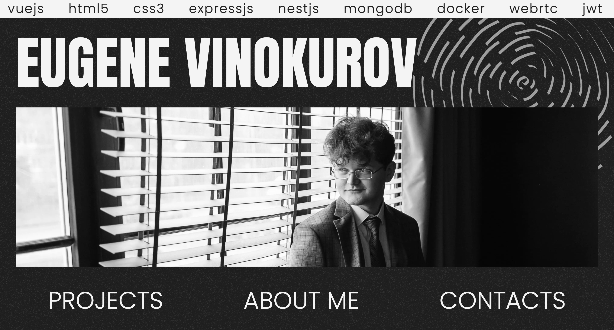

[](https://eugevin.ru)


Nuxt.js portofolio for [my website](https://eugevin.ru). Builded with Vite, Nuxt and some few thugs.

## DEV MODE

```bash
bun i
bun dev
```

Default server location: http://localhost:3000

## PROD MODE

```bash
docker compose up -d
```
